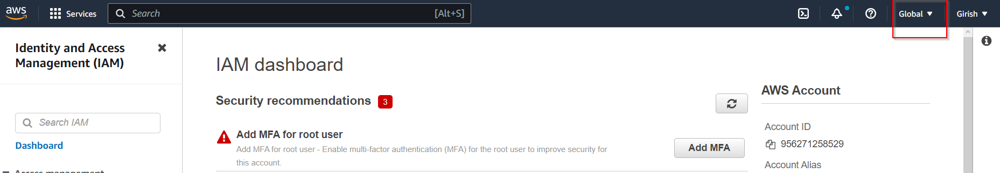
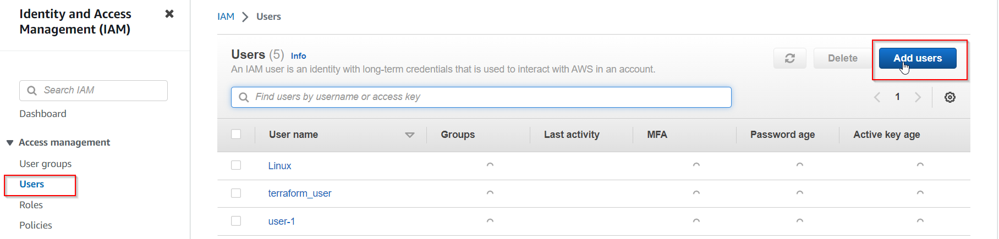
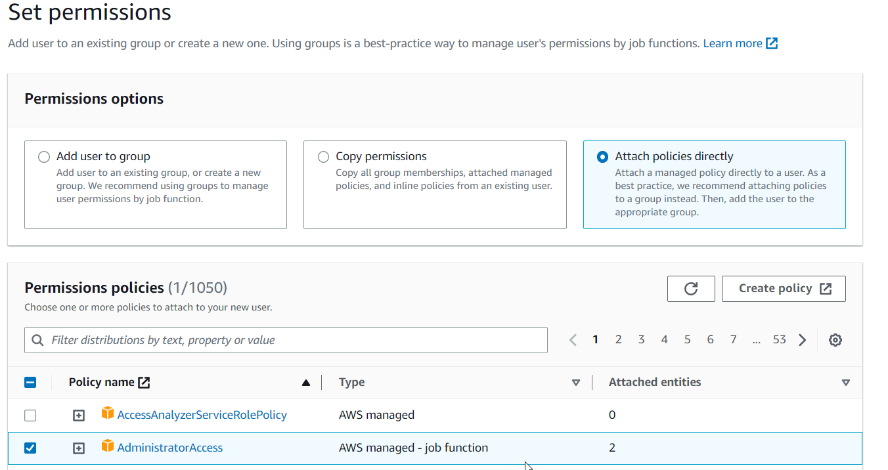
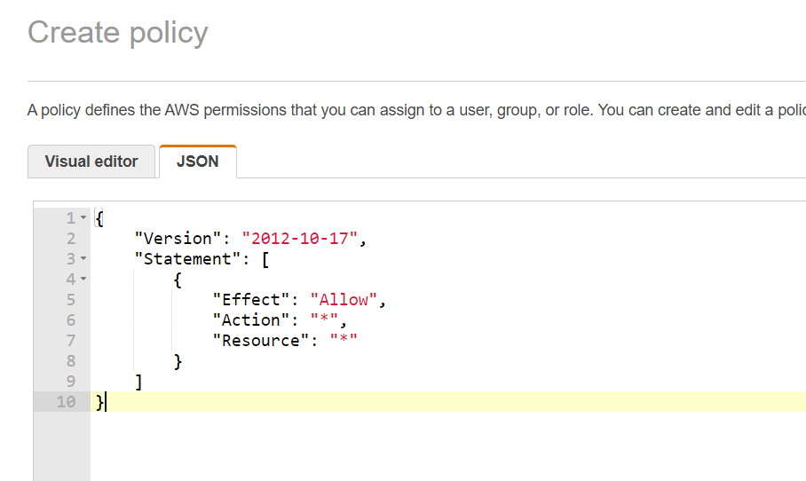
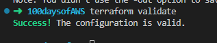
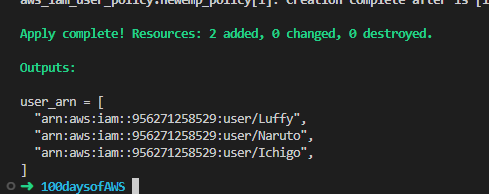
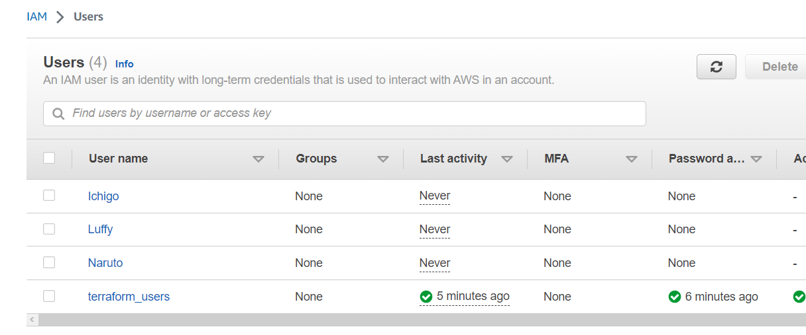
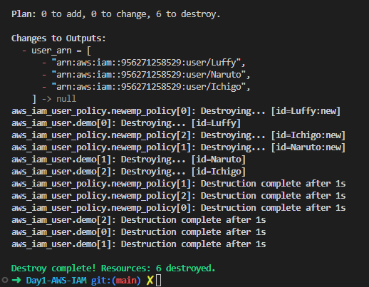

## Day 1 – AWS IAM User

### What is IAM?

- AWS Identity and Access Management (IAM) enables you to securely control access to AWS resources for your users. IAM helps you to manage user access to your AWS resources, so you can control who has access to your resources and what actions they can perform. IAM allows you to create and manage AWS users and groups, assign specific permissions to those users and groups, and generate security credentials for users to access AWS services.

In the AWS Management Console, you may notice that the label ``Global`` appears at the top right-hand side of the screen. This indicates that when you create a user, group, or role in this console, it will be applied globally to all regions in your AWS account.



To add a new user, simply access the Users section from the left navigation bar and then select the option to Add users and then add all the details



### IAM Policies

IAM Policies are formal documents that specify one or more permissions. As an example, IAM offers pre-built policy templates that can be assigned to users and groups.



It is possible to devise a personalized policy either by utilizing a policy generator or by creating one from scratch.



More than one policy can be attached to a user or group at the same time

Now we understand how to create the user manually, let automate the process

## Creating AWS IAM Users and Applying Policies using Terraform
### IAM Users
#### Creating an IAM user:
In Terraform, creating a single IAM user is straightforward. To do this, you can use an `aws_iam_user` resource block, providing a name for the user. If the goal is to create only one user, this is a relatively uncomplicated process.

```
resource "aws_iam_user" "demouser" {
    name = "tuckerdemo"
}
```

#### Creating multiple IAM users:
By utilizing the `count` meta-argument in Terraform, it is possible to replicate a resource as many times as specified. In the provided example, the resource is duplicated three times

 - `aws_iam_user` - This resource is used to create an AWS IAM user.

```
resource "aws_iam_user" "demo" {
  count = 3
  name = "demo"
}
```
However, a limitation of using `count` in this manner is that all three users would have identical names, namely "demo", which may not be desirable.

When you use `count.index` following the name, you will receive a unique index number that corresponds to each occurrence of the resource block.
```
resource "aws_iam_user" "demo" {
  count = 3
  name = "demo.${count.index}"
}   
```
However, if our users require distinct names that do not begin with the same characters and end with a numerical value, this approach would not be suitable without additional modifications.

In the code provided below, the length function will give a result of 3, indicating that there are three users in the username list. The element function will return the individual name from the username list that corresponds to the unique index number specified by the count argument ([0]=Luffy, [1]=Naruto, [2]=ichigo).

- `name`    - This is a mandatory argument to define user name as part of resource creation.
- `count`   - Variable to take the length of the user list and save it.
- `element` - It's an intrinsic function of terraform to retrieve a single element from a list.


```
resource "aws_iam_user" "demo" {
  count = length(var.username)
  name =  element(var.username,count.index)
}
```

To obtain a list of ARNs for all the users we create, we can use an output file and create an output block specifically for `user_arn`. By using the `*` in the value line, the ARN for all AWS IAM users will be displayed. However, if we only want the ARN for a specific user, we need to replace the `*` with the user's index number in the list (0, 1, 2, etc.).

```
output "user_arn" {
  value = aws_iam_user.demo.*.arn
}  
```

#### IAM Policies

```
resource "aws_iam_user_policy" "newemp_policy" {
  count = length(var.username)
  name = "new"
  user = element(var.username,count.index)
policy = <<EOF
{
  "Version": "2012-10-17",
  "Statement": [
    {
      "Effect": "Allow",
      "Action": [
        "ec2:Describe*"
      ],
      "Resource": "*"
    }
  ]
}
EOF
}
```

### Result
Run `terraform fmt` to rewrite Terraform configuration files to a canonical format and style.

Run `terraform validate` to validate the configuration files in the directory.



Run `terraform plan` and then `terraform apply --auto-approve`

After running `terraform apply --auto-approve`, we get an output showing that the users have been created.



Navigating to the AWS console, under IAM, we notice the users were created succesfully.



Run `terraform destroy` to delete everything.



