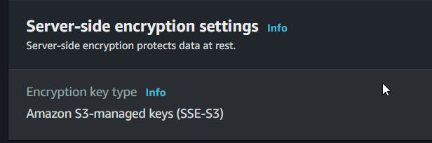

# S3 Object Lock

- S3 Object Lock is a feature in Amazon S3 that allows users to apply a retention policy to their S3 objects.
- This feature is designed to prevent objects from being deleted or modified for a specified retention period.
- Object Lock can be used to protect data from accidental or malicious deletion, ransomware attacks, or to meet regulatory compliance requirements.
- There are two modes of Object Lock available in S3: Governance mode and Compliance mode.
- In Governance mode, users can set retention periods for their S3 objects, but the policy can be removed by a privileged user with sufficient permissions.
- In Compliance mode, users can set retention periods that cannot be overwritten or deleted by anyone, including privileged users.
- Object Lock can be applied to both new and existing objects, and can be enabled or disabled at any time. 
- Users can also configure legal hold for specific objects to protect them from deletion or modification, even if the retention period has expired.
- S3 Object Lock is compatible with S3 Lifecycle policies, Versioning, and Cross-Region Replication features.
- Object Lock can be managed using the AWS Management Console, AWS CLI, or AWS SDKs.

## Rentention Policy

- A retention policy is a feature that allows users to set a minimum retention period for objects stored in their S3 buckets. It is used to prevent accidental or malicious deletion, and to comply with regulatory or legal requirements that mandate data retention.

## Rentention Periods

- Retention periods refer to the length of time that an object stored in an S3 bucket is required to be retained and protected from deletion or modification.
- After the rentention period expire, the object version can be overwritten or deleted unless  you place a legal hold on the object.

## Legal Hold   
- Legal hold is a feature that allows users to apply a hold on objects stored in their S3 buckets, preventing them from being deleted or modified for a specified period of time. It is often used to preserve objects that are subject to legal or regulatory holds, such as in the case of litigation or an audit.
- Legal holds can be freely placed and removed by any user who has the `s3:PutObjectlegalHold` permission. 

## Glacier Vault Lock
- Glacier Vault Lock is a feature of Amazon S3 Glacier that allows users to lock down their Glacier vaults to meet regulatory compliance requirements. 
- Glacier Vault Lock allows users to set a compliance policy that governs the retention and deletion of data in their Glacier vaults.
- Once a Vault Lock policy is applied, the policy cannot be changed or deleted until the predefined retention period has expired.
- Vault Lock policy can be set to either Governance or Compliance mode.

# Encrypting S3 Objects
- `Server-side encryption` is a feature in Amazon S3 that encrypts the data stored in S3 objects before storing them in S3 buckets. There are two types of server-side encryption in Amazon S3: `SSE-S3` and `SSE-KMS`.
- `SSE-S3` encrypts the S3 objects using Amazon S3-managed keys, which are automatically rotated on a regular basis.
- `SSE-KMS` encrypts the S3 objects using keys stored in the AWS Key Management Service (KMS). Users can manage the lifecycle of these keys, including rotation and deletion.

- `Server-side encryption with customer-provided keys (SSE-C)`: This encryption option allows users to provide their own encryption keys to encrypt the S3 objects. The keys are not stored in S3, and users are responsible for managing and securing their encryption keys.

- S3 objects can also be encrypted using `client-side encryption`, which encrypts the data before it is uploaded to S3. This can be done using tools like AWS SDKs or third-party encryption libraries.
- S3 objects that are encrypted using server-side encryption can be accessed and decrypted by authorized users and applications without any additional steps or configuration.

## Enforcing  Server-Side Encryption 
2 ways: 
1. `Console`:
Select the encryption  setting  on your s3 bucket.
2. `Bucket Policy`:
You can also enforce encryption using a bucket policy

- Amazon S3 provides three types of server-side encryption: `SSE-S3`, `SSE-C`, and `SSE-KMS`.
- To enforce server-side encryption in S3, users can create and apply a bucket policy that requires all objects uploaded to the bucket to be encrypted using server-side encryption.
- The bucket policy should include a "Condition" element that checks whether the `x-amz-server-side-encryption` header is present and whether it is set to the desired encryption type (e.g., "AES256" for SSE-S3).
- The bucket policy can also include a "Deny" element that blocks any attempts to upload objects without server-side encryption.
- Users should ensure that all applications, users, and services that upload objects to the S3 bucket comply with the server-side encryption policy.

## DEMO
1. Create a new bucket, enable `Default Encryption` and select `Amazon S3-managed keys (SSE-S3)`.
2. Add some files
3. After the object has been uploaded, click on it and you can see that it is encrypted.

