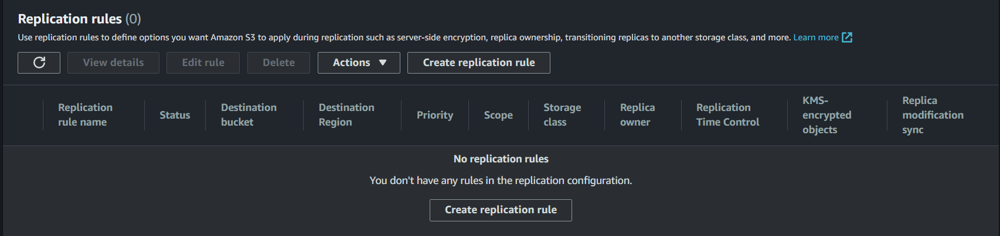
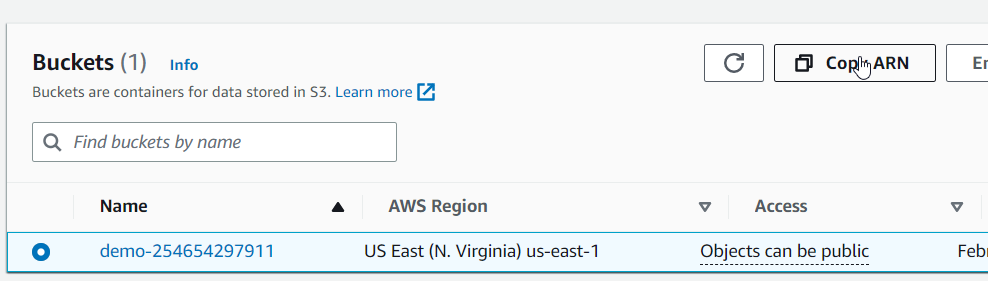
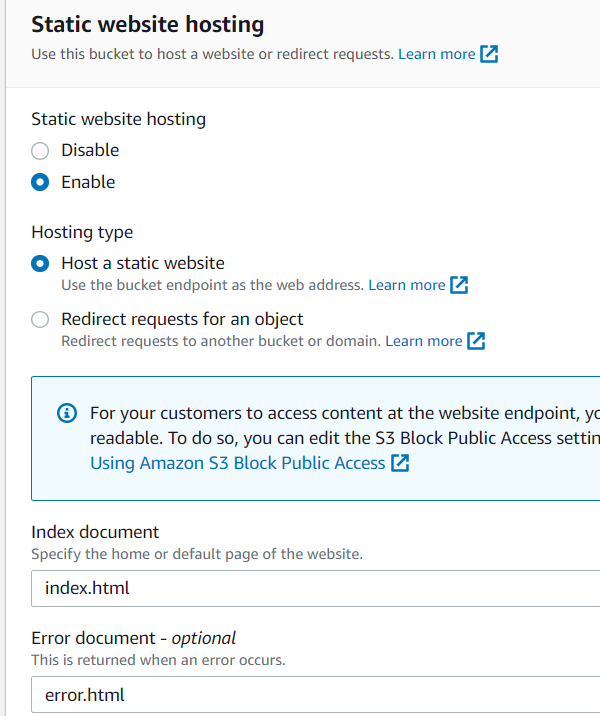
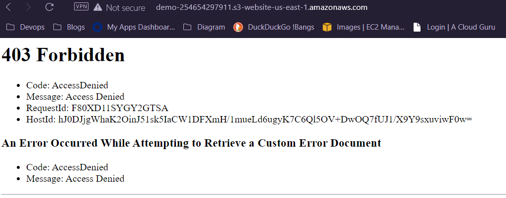
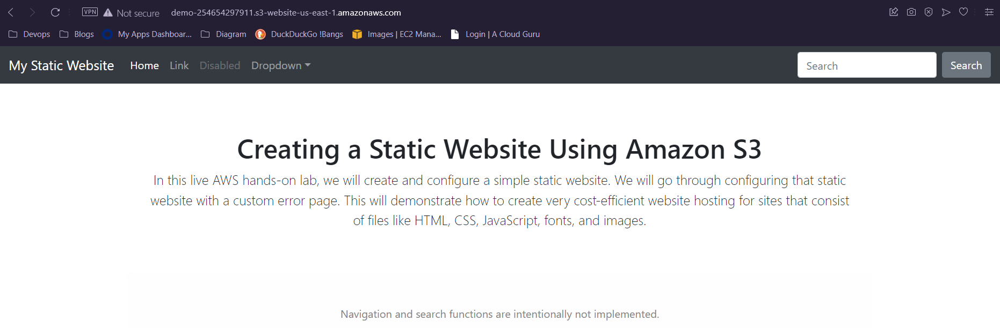

# Optimizing S3 Performance

## s3 Prefixes
- S3 prefixes are used to organize objects within an S3 bucket.
- A prefix is a string that appears at the beginning of an object's key name, separated by a forward slash (/).

# Backing up Data With S3 Replication
- You can Replicate objects from one bucket to another.
- Objects in an existing bucket are not replicated automatically.
- Delete markers are not replicated by default.

# demo

## Backing up Data With S3 Replication
1. Create two S3 buckets: a source bucket and a destination bucket.
2. Enable replication by going to the S3 console, selecting the source bucket, clicking on the `Management` tab, and selecting `Replication.`
3. Create a new replication rule by clicking on the "Add rule" button.

4. Choose the source bucket and destination bucket for the replication, and select the replication configuration that you want to use.
5. To test the replication, upload a file in the source bucket and observe the results in the destination bucket.


## Create a Static Website Using Amazon S3

### Create Bucket
1. Create bucket.
2. In the Block Public Access settings for this bucket section, un-check Block all public access.
3. Leave the rest of the settings as their defaults and Create Bucket.
4. Click Copy ARN and paste it into a plaintext file, as you'll need it later.

5. Upload the `error.html` and `index.html ` to the bucket.

### Enable Static Website Hosting
1. Click the Properties tab.
2. Scroll to the bottom of the screen to find the Static website hosting section.
3. On the Edit static website hosting page, set the following values:
    - Static website hosting: Enable
    - Hosting type: Host a static website
    - Index document: index.html
    - Error document: error.html



4. In the `Static website hosting` section, open the listed endpoint URL in a new browser tab. You'll see a 403 Forbidden error message.


### Apply Bucket Policy
1. Click the `Permissions` tab, edit the `Bucket policy` section.
2. In the Policy box, enter the following JSON statement (replacing <BUCKET_ARN> with the one you copied earlier):
```
{
    "Version": "2012-10-17",
    "Id": "Policy1645724938586",
    "Statement": [
        {
            "Sid": "Stmt1645724933619",
            "Effect": "Allow",
            "Principal": "*",
            "Action": "s3:GetObject",
            "Resource": "<BUCKET_ARN>/*"
        }
    ]
}
```
3. Refresh the browser tab with the static website. This time, the site should load correctly.

