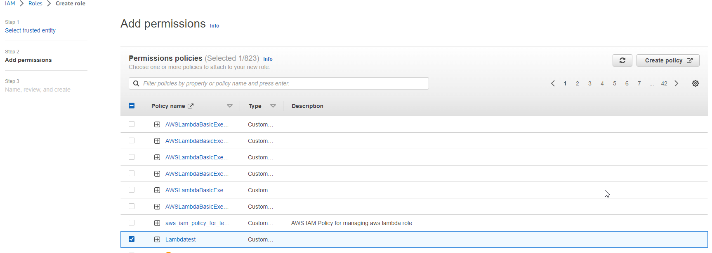
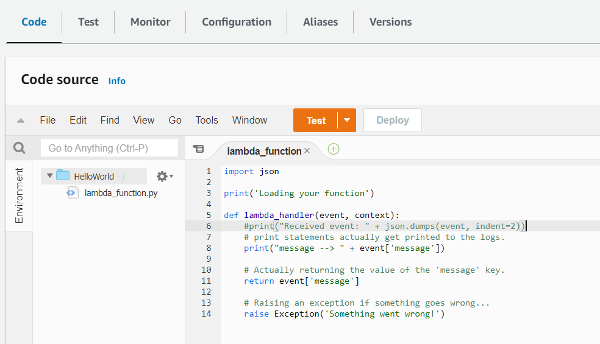
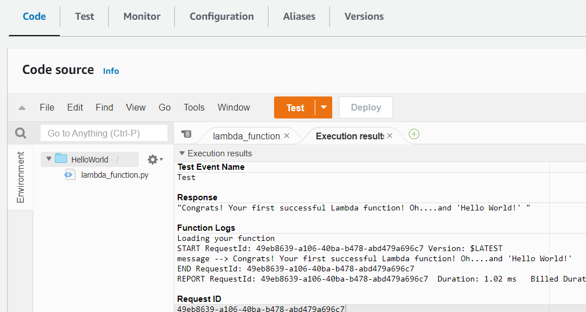
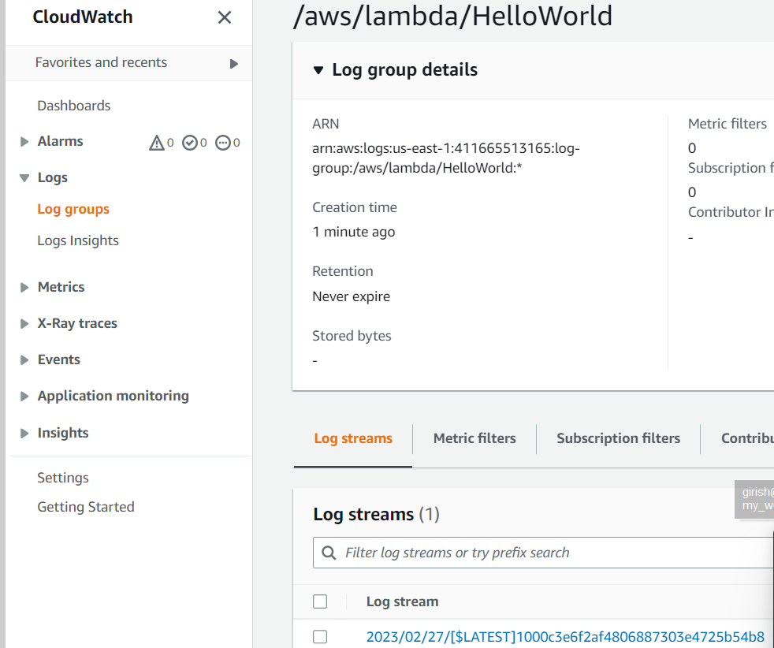
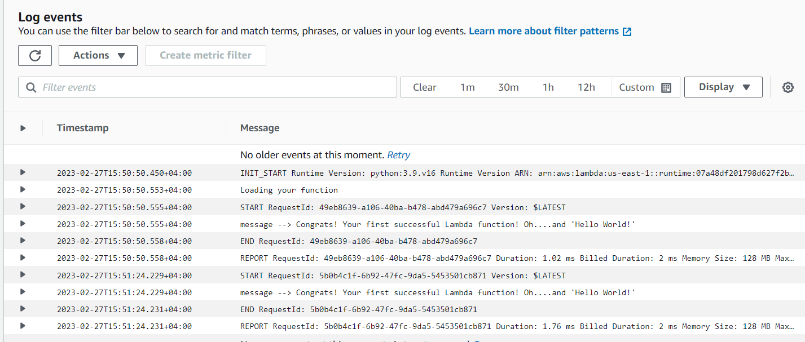

AWS Lambda is a powerful serverless computing service that allows you to run code without provisioning or managing servers. With Lambda, you can build scalable, event-driven applications that respond to events in real-time. One of the key benefits of Lambda is its ability to execute code in response to events from a wide range of sources, including Amazon S3, Amazon DynamoDB, and Amazon API Gateway.

In this blog post, we'll explore how to create and test a Lambda function on AWS manually. We'll start by choosing the right runtime and language for our function, then write the code and upload it to Lambda. Next, we'll test the function to ensure it's working correctly, and configure triggers to execute the function in response to events. Finally, we'll monitor the function's performance to ensure it's running smoothly and troubleshoot any issues that arise.

## Create a Lambda Function within the AWS Lambda Console

1. Navigate to IAM, Create a Role and Policy.
2. Click `Create Policy` and add the following code the JSON tab and create policy.
    ```
    {
        "Statement": [
            {
                "Action": [
                    "s3:*",
                    "lambda:*",
                    "logs:*"
                ],
                "Resource": "*",
                "Effect": "Allow"
            }
        ]
    }
    ```
3. Once the policy create, create a Role and attached the policy to it.

    

4. Now, navigate to `Lambda` and `Create a function`.

5. Make sure the `Author from scratch` option at the top is selected, and then use the following settings:
    - Basic information:
        - Name: HelloWorld
        - Runtime: Python3.6
    - Permissions:
        - Select Choose or create an execution role.
        - Execution role: Use an existing role
        - Existing role(Select the role you've created): lambdarole 
6. Scroll to the code source section and add the following code :
    ```
    import json

    print('Loading your function')

    def lambda_handler(event, context):
        #print("Received event: " + json.dumps(event, indent=2))
        # print statements actually get printed to the logs.
        print("message --> " + event['message'])

        # Actually returning the value of the 'message' key.
        return event['message']

        # Raising an exception if something goes wrong...
        raise Exception('Something went wrong!')
    ```
7. Click Deploy.

    


## Create a Test Event and Manually Invoke the Function Using the Test Event
1. In the dropdown next to Test at the top of the Lambda console, select `Configure test events`.
2. In the dialog, select `Create new test event`.
3. Select the `Hello World` event template.
4. Replace the current code there with the JSon code below, and then click Create.
    ```   
    {
    "message": "Congrats! Your first successful Lambda function! Oh....and 'Hello World!' ",
    "notmessage": "If this shows, it is broken!"
    }
    ```
5. Click `Test` to verify the function's success.

    


## Verify That CloudWatch Has Captured Function Logs
1. Navigate to `CloudWatch`.
2. Select Logs in the left-hand menu.
3. Select the log group with your function name in it.

    

4. Verify the output is present and correct.

    


