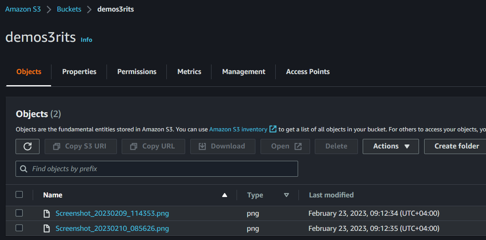
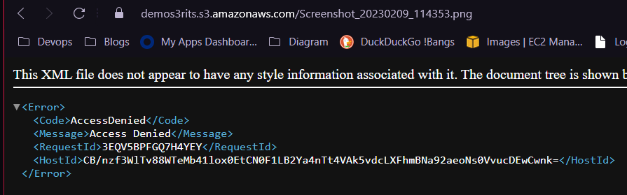
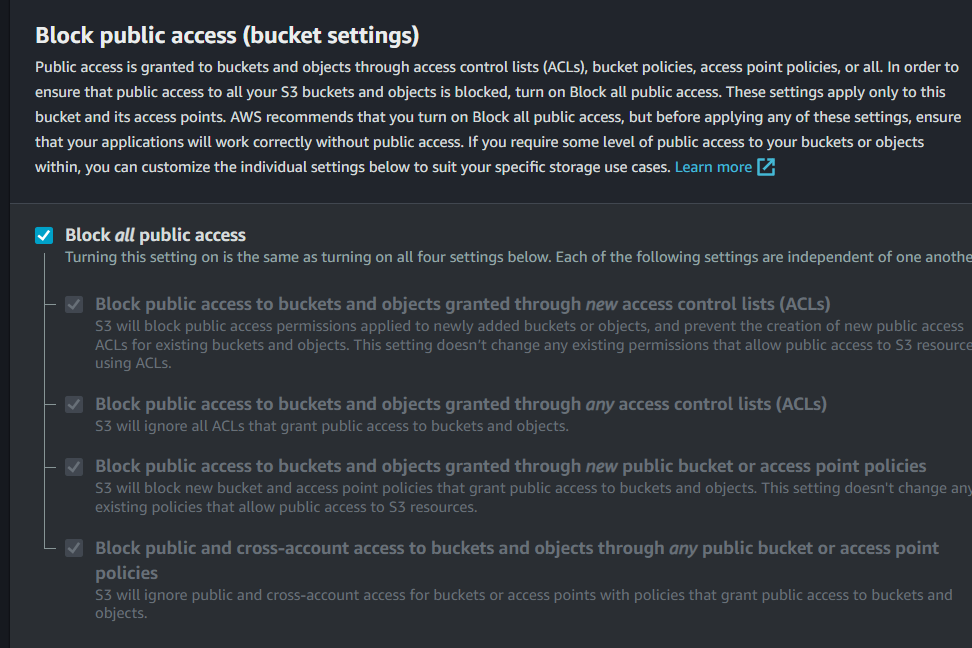
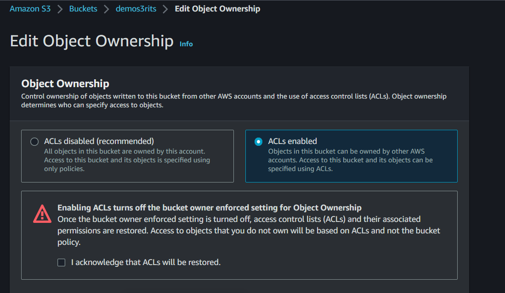
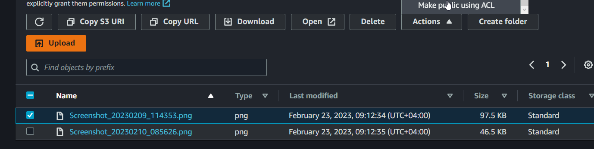

# Securing Your Bucket with S3 Block Public Access

## Bucket ACL:
- Bucket ACL stands for "Bucket Access Control List" and is used to define access permissions for individual users or groups.
- Bucket ACL is used to grant or deny specific permissions to individual AWS accounts, IAM users, or predefined groups.
- Bucket ACL is simpler and easier to understand compared to bucket policies.
- Bucket ACL can only be used to control access to individual buckets, not objects within the bucket.
- Bucket ACL can be managed using the AWS Management Console, AWS CLI, or AWS SDKs.

## Bucket Policies:
- Bucket Policies are used to define access permissions for a whole bucket or a specific set of objects within the bucket.
- Bucket Policies use JSON-based policy language to define access control rules.
- Bucket Policies are more powerful than bucket ACLs and allow for more fine-grained access control.
- Bucket Policies can be used to define cross-account permissions and can be attached to multiple buckets.
- Bucket Policies can be managed using the AWS Management Console, AWS CLI, or AWS SDKs.

## DEMO

Create a bucket and upload files onto it.

"If we try to click on the URL for the object, we will receive an "access denied" message. So even tho our object exists within s3, currently it's denied access for public read.

To make each object publicly accessible:

1. Click on `Permissions`, edit `Block public access (bucket settings)` and uncheck the box as shown.

2. Go to `Permissions` again, edit `Object Ownership` and click on `ACLs enabled`.

3. The objects in your bucket should now be publicly accessible via their URLs. You can retrieve the URL for an object by selecting it in the S3 console, clicking on "Actions", and selecting "Make public".

4. Now if we click on the object url, we can see that it works.

